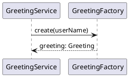

# Design is Code (DisC)

A UML-to-code methodology where tests force AI to follow your design. No code review needed.

> DisC builds on the London school of TDD (Freeman & Pryce, *Growing Object-Oriented Software, Guided by Tests*, 2009) and applies it to AI-assisted code generation.

## The Problem

AI code generation has two root causes of failure:

1. **Natural language is ambiguous.** The same prompt produces different code every time. There's no contract — just vibes.
2. **Cost is asymmetric.** AI generates in seconds; you review for hours. And if you can't verify the output, you're shipping hope.

Vibe coding works — until it doesn't. The codebase grows, reviews take forever, architecture drifts, and you start thinking: *there has to be a better way.*

DisC is what comes after.

## Why UML, Not Natural Language?

Every generation of software engineering raised the abstraction level: machine code → assembly → structured programming → OOP. Each step replaced ambiguity with precision.

Natural language goes the wrong direction — it's maximally ambiguous. UML sequence diagrams are precise: boxes are components, arrows are calls, labels are method signatures. No interpretation needed.

## How It Works

```
UML Sequence Diagram
        |
        v
  Phase 1: UML → Tests  (each arrow = one verify() test)
        |
        v
  Phase 2: Tests → Implementation  (reads tests only, never UML)
        |
        v
  Working Code
```

The `/design-is-code:disc` command runs both phases **in sequence within a single invocation** — Phase 1 generates tests from the UML, then Phase 2 reads only the tests to derive the implementation. Phase 2 never sees the UML. This wall ensures the code matches exactly what the tests demand.

Each arrow in your UML becomes a `verify()` call using London-style mockist tests — tests that verify **call structure** (which collaborators are called, in what order, with what arguments), not internal state. `verify(repository).save(product)` only passes if the implementation actually calls `repository.save(product)`. The AI can't skip it, reorder it, or change the arguments. You review the design, not the code.

## Quick Start

1. Install the plugin in Claude Code:
   ```
   /plugin marketplace add mossgreen/design-is-code-plugin
   /plugin install design-is-code@mossgreen-design-is-code-plugin
   ```
2. Put your UML sequence diagram in your project's `design/` folder
3. Run `/design-is-code:disc <filename>` in Claude Code
4. Check TODOs in the generated code (decision table skeletons for pure functions need human-designed test cases)
5. Run `./gradlew test`

## Example

Given the hello-world UML (`design/01_hello-world.puml`):



DisC generates:

- 1 solid arrow (`->`) = 1 `verify()` test
- 1 return arrow (`<--`) = 1 `when().thenReturn()` stub
- Result: 7 files — model, interfaces, test, implementation, and a leaf-node decision table skeleton

## What Gets Generated

| What | Convention | Example |
|---|---|---|
| Interface | From participant name | `GreetingService.java` |
| Implementation | `Default` + name | `DefaultGreetingService.java` |
| Test | Impl + `Test` | `DefaultGreetingServiceTest.java` |
| Leaf node skeleton | Decision table with TODOs | `DefaultGreetingFactoryTest.java` |

## TODOs in Generated Code

DisC generates decision table **skeletons** for pure functions (Mappers, Factories, etc.). These contain TODO markers where the human must fill in the test cases.

AI should not invent both the test cases and the implementation for pure functions — that creates false positive risk where tests pass but the logic is wrong. The human designs the decision table; the AI implements it.

## Who Does the Design?

| What | Who | Why |
|---|---|---|
| Component interactions (UML arrows) | Developers | Architecture decisions require engineering judgment |
| Pure function test cases (decision tables) | Product / QA team | Business rules and edge cases require domain knowledge |
| Implementation | AI | Mechanical — forced by the tests |