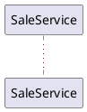

# Java / Spring Boot Language Profile

The `language_profile` for Java/Spring. Owns all Java/Spring-specific conventions, templates, and examples for the DisC methodology.

---

## Target Placement Declaration

In Java/Spring, a design file's `target_placement` is a fully-qualified package. Each design file declares it directly.

### In `.puml` files

A header comment on the line immediately after `@startuml`:



The package is the placement for every artifact derived from this diagram.

### In `.decision.md` files

A `package:` field in the YAML frontmatter:

```yaml
---
target: BulkDiscountCalculator.calculate
package: com.demo.sale
input:
  quantity: Integer
  lineSubtotal: BigDecimal
output: BigDecimal
---
```

The package is the placement for the leaf's interface, implementation, and test.

### Resolution

`{basePackage}` resolves per-file to the file's declared package. `{basePackagePath}` is `{basePackage}` with `.` replaced by `/` (e.g., `com.demo.sale` → `com/demo/sale`).

---

## PlantUML notation for `system_caller`

In PlantUML sequence diagrams, the `system_caller` (the boundary marker for the system under test) is written as the literal token `[*]`, borrowed from PlantUML's initial-state notation. It is the source of the entry interaction and (optionally) the target of the final return. Because the `system_caller` is not a `participant`, it is never declared with a `participant` keyword — it appears only inline as the caller of the entry arrow.

```
@startuml
' @package com.example.product
[*] -> ProductService : createProduct(createProductRequest)
ProductService -> ProductRepository : save(product)
ProductService <-- ProductRepository : savedProduct : Product
[*] <-- ProductService : savedProduct : Product
@enduml
```

- Exactly one entry interaction per `.puml`.
- The entry interaction's `call_arrow` label has the form `method(arg1, arg2, ...)`. The method name is the SUT's public method-under-test. The arguments become test inputs (mocked or real, per the Domain Type Rule below).
- The optional return arrow `[*] <-- SUT : value : Type` declares the explicit final return.

---

## PlantUML notation for `participant_target`

A `participant_target` is declared on a participant using PlantUML's stereotype syntax — `<<...>>` placed after the participant name on its `participant` declaration line. The three forms map directly to the abstract values defined in `SKILL.md`.

```plantuml
@startuml
' @package com.example.sale
participant SaleService                                                       ' create (default)
participant Money               <<@class:com.example.common.Money>>           ' existing
participant DiscountRepository  <<@class:com.example.sale.DiscountRepository, +findActive>>  ' extend
```

### Stereotype grammar

- **`<<@class:fqn>>`** — abstract `existing:<fqn>`. Participant is reused from the type at `<fqn>`. DisC generates no files for it.
- **`<<@class:fqn, +method1, +method2>>`** — abstract `extend:<fqn>:+method1,+method2`. Participant exists at `<fqn>` but the design adds the listed methods. Each `+method` must match a `call_arrow` callee method on this participant in the diagram.
- **`<<@regen:fqn>>`** — abstract `regenerate:<fqn>`. The orchestrator at `<fqn>` is overwritten from the design (REGEN mode). `<fqn>` resolves to either an interface or a class (see FQN form): an interface means the `Default<Name>` convention applies — rewrite `Default<Name>.java` and `Default<Name>Test.java`, leaving the interface `<Name>.java` untouched; a class is its own implementation — rewrite `<Name>.java` and `<Name>Test.java`, preserving the class's public method signatures exactly (a change to the public surface is a separate `extend:` concern). The participant MUST have outgoing `call_arrow`s.
- **Absence of stereotype** — implicit `create`. The default for greenfield design.

### FQN form

`com.foo.bar.PascalCaseName` — must match the Java/Spring package convention and resolve to either an interface (preferred) or class file under `src/main/java/{basePackagePath}/.../<PascalCaseName>.java`.

When both `Foo` (interface) and `DefaultFoo` (impl) exist for the same abstraction, `@class:` MUST point to the **interface**. DisC locates the implementation via the naming convention (`Default` + interface name, or the colon-syntax override). Pointing `@class:` at an `*Impl` would tie the design to a specific implementation and is refused by Step 1.

### Method-list form

`+method1, +method2` — comma-separated. Each `+method` is the camelCase method name only — no parameter list, no return type. The parameters and return type come from the diagram's `call_arrow` for that method.

The listed methods must each appear as a `call_arrow` label on this participant somewhere in the input set. A `+method` with no matching arrow refuses at Step 1: the design has declared an extension that does not exercise the new method.

### Where the prelude sits in a `.puml`

The participant declarations live between the `' @package ...` header and the first `call_arrow`. Existing PlantUML syntax — they declare the diagram's cast up front. Participants referenced only via inline `A -> B : method(x)` (without an explicit `participant` declaration) default to `create`. Authors who want REUSE or UPDATE must declare the participant explicitly with the stereotype.

### Worked example

```plantuml
@startuml
' @package com.example.sale
participant SaleService
participant OwnerRepository    <<@class:com.example.owner.OwnerRepository>>
participant DiscountRepository <<@class:com.example.sale.DiscountRepository, +findActive>>

[*] -> SaleService : createSale(saleRequest)
SaleService -> OwnerRepository : findById(ownerId)
SaleService <-- OwnerRepository : owner
SaleService -> DiscountRepository : findActive(ownerId)
SaleService <-- DiscountRepository : discounts
[*] <-- SaleService : saleResponse : SaleResponse
@enduml
```

Each `participant` declaration must fit on a single line — including the stereotype. Multi-line declarations are not supported.

Step 3 outcomes per participant:

| Participant            | `participant_target`              | Mode    | Generated files |
|------------------------|-----------------------------------|---------|---|
| `SaleService`          | (no stereotype → `create`)        | CREATE  | `SaleService.java`, `DefaultSaleService.java`, `DefaultSaleServiceTest.java` |
| `OwnerRepository`      | `existing:com.example.owner...`   | REUSE   | none — referenced only as `@Mock` in `DefaultSaleServiceTest` |
| `DiscountRepository`   | `extend:...:+findActive`          | UPDATE  | adds `findActive(...)` to existing `DiscountRepository.java`, `DefaultDiscountRepository.java`, `DefaultDiscountRepositoryTest.java` |

`OwnerRepository.findById`'s signature is read from the existing source so the `@Mock OwnerRepository ownerRepository` field and the `when(ownerRepository.findById(any())).thenReturn(owner)` stub type-check.

`DiscountRepository` gets a new method signature appended to the existing interface, a new method body appended to the implementation (with any new constructor parameters and fields if `findActive` introduces new dependencies — though in this example it does not), and a new `@Nested` test class for `WhenFindActive`. UPDATE Mode Rules apply: existing methods, mocks, and tests are sacred.

---

## PlantUML notation for `entity_declaration`

Entities are declared in an `entity_prelude` immediately after the `' @package` header and before the participant prelude. The prelude block is preceded by the marker `' @disc-entities`. Each `entity_declaration` is one PlantUML `class` line with a kind stereotype and an optional body. The five kinds are `record`, `enum`, `class`, `interface`, `sealed-interface`. The REUSE form `<<@class:fqn>>` carries no body.

```plantuml
@startuml
' @package com.example.consumer
' @disc-entities type declarations the participants pass around
class Parent <<sealed-interface>> <<@permits:V1,V2>> {
  + behave(input: int): String
}
class V1 <<record>> {
  + id: String
}
class V2 <<record>> {
  + id: String
}
class Kind <<enum>> {
  + KIND_A
  + KIND_B
}

' @disc-classification CREATE (no stereotype), REUSE (@class), UPDATE (@class + +methods)
participant ConsumerService
[*] -> ConsumerService : doWork(payload, input)
ConsumerService -> Parent : behave(input)
ConsumerService <-- Parent : result : String
[*] <-- ConsumerService : result : String
@enduml
```

### Kind stereotype grammar

- **`<<record>>`** — Java record. Body lists fields: `+ fieldName: Type` per line. Becomes `public record Name(Type fieldName, ...)`.
- **`<<enum>>`** — Java enum. Body lists values: `+ VALUE_NAME` per line.
- **`<<class>>`** — mutable POJO. Body lists fields like `record`. Becomes a class with private fields, a no-arg constructor, getters, and setters. Use sparingly; prefer `record`.
- **`<<interface>>`** — plain contract type (not a participant). Body lists behaviors: `+ method(arg: Type, ...): ReturnType`. MAY be paired on the same line with `<<@permits:V1,V2,...>>` when the contract has a known set of implementations declared in the same prelude. The permits are a design-time manifest only — the generated Java does NOT carry the `sealed` keyword, no `non-sealed`/`final` modifiers are emitted on the permits, and the Java type is open to outside implementations at runtime. Each permit must resolve to a `record` or `class` `entity_declaration` in the same prelude. The order of `<<@permits:>>` is preserved in the generated artifacts.
- **`<<sealed-interface>>`** — sealed contract type. Body lists behaviors (may be empty for pure sum types). **MUST** be paired on the same line with `<<@permits:V1,V2,...>>` listing 2+ variant names. Each permit must resolve to a `record` or `class` `entity_declaration` in the same prelude.

### REUSE form

- **`<<@class:fqn>>`** on an entity = `entity_target = existing:<fqn>`. No file is generated. The plugin reads the existing source to capture the entity's shape (fields, permits) for downstream codegen. **Declaring body content on a REUSE entity refuses at Step 1** — REUSE is FQN binding only.
- A REUSE `sealed-interface` may include `<<@permits:V1,V2>>` for human readability of the design, but the listed permits MUST match the existing source's `permits` clause exactly; mismatch refuses at Step 1.

### Permits stereotype

- `<<@permits:V1,V2>>` — comma-separated, no spaces required between names. Lives on the same line as `<<sealed-interface>>` OR `<<interface>>`. Each name must appear as another `entity_declaration` of kind `record` or `class` in the same prelude.
- **Interface vs sealed-interface with permits — when to use which.** Use `<<sealed-interface>>` + permits when the variant set is closed AT THE JAVA LEVEL (compile-time exhaustiveness on `switch`, no third-party implementors). Use `<<interface>>` + permits when the variant set is closed in the *design* (the manifest lists every implementation the design owns) but the Java contract should remain open (third-party impls, Spring `@Service` strategies, Spring Boot auto-configuration). The resolver pattern's strategy hierarchy is the canonical `<<interface>>` + permits case.

### When the prelude is absent

When `.puml` files carry no `' @disc-entities` marker, Step 2.8 short-circuits to no-op; every type token referenced in a method signature that does not match a `participant` is generated as a plain class under `{basePackage}.entity` (signature-inference path).

### Where the prelude sits

Between the `' @package` header (line 1 after `@startuml`) and the participant prelude (`' @disc-classification ...`). Entity declarations live above participant declarations because data flows are upstream of the behaviors that exchange them.

---

## PlantUML notation for `defer-design`

A `defer-design` stereotype marks a participant whose internals have not yet been designed; design them later in their own `.puml`. The SUT mocks this participant as a `collaborator` (one-hop mocking), and DisC emits an interface + a throwing stub-impl so the Spring application context still wires.

```plantuml
@startuml
' @package com.example.sale
participant SaleService
participant DiscountCalculator <<defer-design:CreateSale/DiscountCalculator.puml>>
participant OwnerRepository    <<@class:com.example.owner.OwnerRepository>>

[*] -> SaleService : createSale(saleRequest)
SaleService -> OwnerRepository : findById(ownerId)
SaleService <-- OwnerRepository : owner
SaleService -> DiscountCalculator : apply(saleRequest)
SaleService <-- DiscountCalculator : discountedAmount : Money
[*] <-- SaleService : saleResponse : SaleResponse
@enduml
```

### Stereotype grammar

- **`<<defer-design>>`** — abstract `defer:<default-path>`. Path defaults to a sibling folder named after the parent `.puml`'s stem: e.g., for `CreateSale.puml` and a deferred participant `DiscountCalculator`, the default path is `CreateSale/DiscountCalculator.puml`.
- **`<<defer-design:relative/path/Child.puml>>`** — abstract `defer:relative/path/Child.puml`. Explicit path, relative to the current `.puml`'s folder.

Single-line invariant: the stereotype lives on the same line as the `participant` keyword, just like `<<@class:fqn>>`.

### Generated files in STUB mode

For a participant declared `<<defer-design>>`, DisC generates **two files** under the file's `target_placement` (per the standard package-placement rules below):

1. `<Name>.java` — the interface, with method signatures derived from the `call_arrow`s the SUT makes on this participant. Same shape as a CREATE-mode interface.
2. `Pending<Name>.java` — a `@Component`-annotated throwing implementation (see *Stub Implementation Template* below).

DisC does **not** generate:
- A test class for this participant. Its tests will be generated when DisC is run on the child `.puml`.
- A decision table file. `defer-design` participants are not `leaf_node`s.

### Worked example: STUB mode

For the diagram above, Step 3 produces:

| Participant         | `participant_target`                              | Mode  | Generated files |
|---------------------|---------------------------------------------------|-------|---|
| `SaleService`       | (no stereotype → `create`)                        | CREATE| `SaleService.java`, `DefaultSaleService.java`, `DefaultSaleServiceTest.java` |
| `OwnerRepository`   | `existing:com.example.owner.OwnerRepository`      | REUSE | none |
| `DiscountCalculator`| `defer:CreateSale/DiscountCalculator.puml`        | STUB  | `DiscountCalculator.java`, `PendingDiscountCalculator.java` (no test class) |

The SUT's test `DefaultSaleServiceTest` still mocks `DiscountCalculator` as a `@Mock` `collaborator` with `verify(discountCalculator).apply(saleRequest)` — one-hop mocking. The deferred child's own implementation comes from a later DisC run on `CreateSale/DiscountCalculator.puml`.

### Stub Implementation Template

```java
package {basePackage}.[package];

import org.springframework.stereotype.Component;

@Component
public class Pending[Name] implements [Name] {

    @Override
    public [ReturnType] [method]([ParamType] [param]) {
        throw new UnsupportedOperationException(
            "DisC: design pending for [Name] — design at [relativePathFromProjectRoot]");
    }
    // ...one method per call_arrow on this participant, all throwing
}
```

Conventions:

- **Annotation:** `@Component`, not `@Service`. `@Service` would imply a real implementation; `@Component` reads as "infrastructure-level placeholder Spring bean".
- **Naming:** `Pending` + interface name. Distinguishes the stub from any future `Default<Name>` that the child `.puml` will produce.
- **Marker string:** the literal substring `DisC: design pending for <Name> — design at <path>` MUST appear in every `UnsupportedOperationException` message. CI greps for `DisC: design pending` to block production deploys.
- **Method bodies:** one per `call_arrow` the SUT makes on this participant. Method signatures match the SUT's call shape.

### Compatibility with other stereotypes

`<<defer-design>>` is mutually exclusive with `<<@class:fqn>>`, `<<@class:fqn, +method>>`, and `<<@regen:fqn>>`. Step 1 refuses any participant declaring more than one form. The five `participant_target` values (`create`, `existing:`, `extend:`, `defer:`, `regenerate:`) form a single dimension; pick exactly one per participant.

---

## Naming Conventions

By default, the participant name is the interface name. 
If the participant uses a colon (e.g., `PriorityOrderService: OrderService`), the left side is the implementation name and the right side is the interface name. 
If no implementation name is defined, use `Default` + interface name.

| Element | Convention | Example                                   |
|---|---|-------------------------------------------|
| Interface | PascalCase, from participant name (or right of `:`) | `OrderService` |
| Implementation class | Left of `:` if defined, otherwise `Default` + interface name | `PriorityOrderService` or `DefaultOrderService`|
| Test class | Implementation name + `Test` | `PriorityOrderServiceTest`                        |
| Test method | `should` + verb phrase describing interaction | `shouldSaveOrder`                         |
| Mock field (collaborator) | camelCase of interface name | `orderMapper`                             |
| Mock field (data) | Variable name from return label. Type from explicit `: Type` or PascalCase inference | `savedOrder : Order` → field: `Order savedOrder` |
| Method-under-test name | Method name from the entry interaction's label | `createSale` ← `[*] -> SaleService : createSale(saleRequest)` |
| Method-under-test parameters | Argument names from the entry interaction's label, types resolved via the Domain Type Rule | `saleRequest` → `@Mock private CreateSaleRequest saleRequest` |
| STUB-mode implementation (defer-design) | `Pending` + interface name | `PendingDiscountCalculator` ← `DiscountCalculator` |

The interface name will be referenced as "InterfaceName"
the implementation name will be referenced as "ImplementationName"
---

## Package Placement

| Suffix | Package | Example |
|---|---|---|
| `*Service` | `{basePackage}.service` | `OrderService.java` |
| `*Repository` | `{basePackage}.repository` | `OrderRepository.java` |
| `*Mapper` | `{basePackage}.mapper` | `OrderMapper.java` |
| `*Factory` | `{basePackage}.factory` | `OrderFactory.java` |
| `*Builder` | `{basePackage}.builder` | `SaleBuilder.java` |
| `*Controller` | `{basePackage}.controller` | `OrderController.java` |
| Entity/model types | `{basePackage}.entity` or `{basePackage}.model` | `Order.java` |
| `sealed-interface` family parent + all its permits | `{basePackage}.entity` (parent and permits share one package) | `Parent.java`, `V1.java`, `V2.java` |
| `interface` parent **with permits** + all its permit classes | `{basePackage}.entity` (parent and permits share one package) | `Parent.java`, `V1.java`, `V2.java` |
| `*Request`, `*Response`, `*DTO` | `{basePackage}.model` | `CreateOrderRequest.java` |
| Test classes | Same package as implementation, under `src/test/java` | `DefaultOrderServiceTest.java` |

If a suffix doesn't match any rule, use `{basePackage}.service` as the default.

---

## File Path Patterns

| Element | Path |
|---|---|
| Interface | `src/main/java/{basePackagePath}/[package]/[InterfaceName].java` |
| Implementation | `src/main/java/{basePackagePath}/[package]/[ImplementationName].java` |
| Test | `src/test/java/{basePackagePath}/[package]/[ImplementationName]Test.java` |
| Domain type | `src/main/java/{basePackagePath}/entity/[Type].java` |

---

## Domain Type Rule

Any type in an interface method signature that represents a domain concept is generated as an **interface**, not a class. This enforces Dependency Inversion.

**Exceptions** — these are NOT domain types; leave as-is, do not generate interfaces for them:

| Category | Examples |
|---|---|
| Primitives/wrappers | `UUID`, `String`, `Integer`, `Long`, `Boolean` |
| Standard generics | `Optional<T>`, `List<T>`, `Map<K,V>`, `Set<T>` |
| Framework types | Spring, JPA types |
| Boundary carriers | `*Request`, `*Response`, `*DTO` |

Primitives and final classes like `UUID`, `Integer`, `String` cannot be mocked. Use real values: `UUID.randomUUID()`, `(int)(Math.random() * 1000)`.

**Note:** if a domain type EXISTS as a class, do not convert to interface. Warn in report.

---

## Test Class Template

```java
package {basePackage}.service;

import org.junit.jupiter.api.BeforeEach;
import org.junit.jupiter.api.Nested;
import org.junit.jupiter.api.Test;
import org.mockito.Mock;
import org.mockito.junit.jupiter.MockitoSettings;
import org.mockito.quality.Strictness;

import static org.assertj.core.api.Assertions.assertThat;
import static org.mockito.ArgumentMatchers.any;
import static org.mockito.Mockito.verify;
import static org.mockito.Mockito.when;

@MockitoSettings(strictness = Strictness.LENIENT)
class [ImplementationName]Test {

    @Mock private [Collaborator1] [collaborator1];
    @Mock private [Collaborator2] [collaborator2];
    @Mock private [InputType] [input];
    @Mock private [ReturnType1] [returnValue1];
    private [FinalReturnType] result;
    [InterfaceName] [implementationName];

    @BeforeEach
    void setUp() {
        [implementationName] = new [ImplementationName]([collaborator1], [collaborator2]);
    }

    @Nested
    class When[MethodName] {
        @BeforeEach
        void setUp() {
            when([collaborator].method(any())).thenReturn([returnValue]);
            result = [implementationName].[methodName]([input]);
        }

        @Test void should[DescribeInteraction]() { verify([collaborator]).[method]([expectedArg]); }
        @Test void shouldReturn[ExpectedResult]() { assertThat(result).isEqualTo([expectedReturnMock]); }
    }
}
```

Mapping to SKILL.md concepts:
- `@Mock` collaborator field = `collaborator` mock
- `@Mock` data field = `data_mock`
- `@Nested` class = `test_group`
- `@BeforeEach` with `when().thenReturn()` = `stub` setup
- `verify()` call = `verify_test`
- `assertThat(result)` = `result_test`

Mapping from the entry interaction (`[*] -> SUT : method(args)`):
- `[methodName]` ← method name in the label
- `[MethodName]` ← `[methodName]` with first letter capitalised (used in `class When[MethodName]`)
- `[input]` ← argument name(s) from the label, comma-separated
- `[InputType]` ← argument type(s), resolved per the Domain Type Rule
- The line `result = [implementationName].[methodName]([input]);` is the materialisation of the entry interaction.

When the SUT has an explicit return to the `system_caller` (`[*] <-- SUT : value : Type`):
- `[FinalReturnType]` ← `Type` from the return label
- `[expectedReturnMock]` ← `value` from the return label

---

## Implementation Template

```java
package {basePackage}.service;

import org.springframework.stereotype.Service;

@Service
public class [ImplementationName] implements [InterfaceName] {
    private final [Collaborator1] [collaborator1];
    private final [Collaborator2] [collaborator2];

    public [ImplementationName]([Collaborator1] [collaborator1], [Collaborator2] [collaborator2]) {
        this.[collaborator1] = [collaborator1];
        this.[collaborator2] = [collaborator2];
    }

    @Override
    public [ReturnType] [methodName]([InputType] [input]) {
        // One line per verify() test, in order
        [ReturnType1] [var1] = [collaborator1].method([input]);
        [ReturnType2] [var2] = [collaborator2].method([var1]);
        return [var2];
    }
}
```

Mapping from the entry interaction:
- `[methodName]([InputType] [input])` — the method-under-test signature comes directly from the entry interaction's label.
- `[ReturnType]` — comes from the explicit return to `system_caller` (`[*] <-- SUT : value : Type`) when present; otherwise `void`.

### Implementation Conventions

- Use `@Service` annotation (or `@Component` for non-service classes)
- Constructor injection for all collaborators (no `@Autowired`)
- One method call per `verify()` test, maintaining the order from the test
- Variable names match the mock field names from the test
- Return type matches the `result` field type in the test

---

## Build Command

```
./gradlew test
```

---

## UPDATE Mode Rules

| File type | ADD | Do NOT touch |
|---|---|---|
| Interface | New method signatures (skip if present) | Existing signatures |
| Test | New `@Nested` class + new `@Mock` fields if not declared | Existing `@Nested`, `@Test`, `@Mock`, setup |
| Implementation | New method + new fields + new constructor params | Existing methods, logging, annotations |
| Domain type (EXISTS) | Nothing — skip | Everything |

For participants with `participant_target = extend:<fqn>:+method1,+method2,...`, UPDATE mode applies to all three files (interface, implementation, test) for that participant. The rules above govern *what* is added: only the listed `+method` signatures, their corresponding method bodies, and one `@Nested` class per `+method` in the test. Methods that already exist on the participant in the source are read for type information (to populate `@Mock` types in dependent tests) but are not re-emitted.

---

## REGEN Mode Rules

For a participant with `participant_target = regenerate:<fqn>` (`<<@regen:fqn>>`), REGEN mode overwrites the orchestrator's own files from the freshly generated design. `<fqn>` resolves to either an interface or a class (see FQN form): an interface means the `Default<Name>` convention locates the files; a class is its own implementation.

| File type | `<fqn>` resolves to an interface | `<fqn>` resolves to a class |
|---|---|---|
| Implementation | **Overwrite** `Default<Name>.java` with the Write tool — body derived from the regenerated test. New constructor params/fields for new collaborators (e.g. an injected resolver) replace the old set. | **Overwrite** `<Name>.java` the same way. The class's public method signatures are its contract — reproduce them exactly. |
| Test | **Overwrite** `Default<Name>Test.java` — the full test for the new design (every `verify()`), not add-only. | **Overwrite** `<Name>Test.java` the same way (create it if absent). |
| Interface | `<Name>.java` **untouched.** The orchestrator's public contract is stable across a body change. A change to the public surface is a separate `extend:` concern. | No separate interface file — the contract is the class's public method signatures, preserved by the Implementation rule. |

**Collaborators and leaves are never touched** by this participant's REGEN — each follows its own `participant_target` (CREATE / REUSE / UPDATE / STUB).

**Cross-cutting concerns.** A regenerable orchestrator's method bodies contain only design-derived calls; `@Transactional`, tracing, metrics, and guards belong at class level, in an aspect, or in configuration. Before overwriting, REGEN reads the existing implementation and reproduces its **class-level annotations** (e.g. `@Service`, `@Transactional`) on the regenerated class verbatim. **Method-level annotations are not preserved** — the design owns method bodies. Every dropped method-level annotation is listed in the Step 8 report (`method-level annotations dropped:`); move it to class level, an aspect, or configuration before committing. Only annotations are tracked — hand-authored body *statements* (logging, inline guards) in a legacy class are dropped without appearing in the report, which is why the first regeneration of a class DisC did not generate carries a full-diff duty (SKILL.md checklist 8).

REGEN is the inverse of UPDATE's add-only rule, allowed for exactly one reason: an orchestrator's implementation is *fully determined* by its design, so overwriting it preserves nothing a human authored. The cross-cutting rule above makes that premise true by construction rather than by convention. This is false for `leaf_node`s — their content is sampled and human-owned — which is why Step 1 refuses `regenerate:` on a leaf.

**Precondition:** the diagram must describe the orchestrator's complete flow. A `call_arrow` the design omits is dropped from the regenerated implementation. The host that emits the `.puml` owns completeness; the operator verifies each regenerated file against version control (Step 8).

### Worked example: REGEN mode (follow-up ticket)

`SaleService` already exists and calls `TaxCalculator.calculate(...)` directly. A follow-up ticket adds a second tax strategy, selected per request. The emitted design routes `SaleService` through a `TaxCalculatorResolver` and adds an `InternationalTax` variant:

```plantuml
@startuml
' @package com.example.sale
class TaxCalculator    <<interface>> <<@permits:DomesticTax,InternationalTax>> {
  + calculate(order: Order): Money
}
class DomesticTax      <<@class:com.example.sale.DomesticTax>>      ' existing variant — leaf, untouched
class InternationalTax <<class>>                                   ' new variant — CREATE skeleton

participant SaleService           <<@regen:com.example.sale.SaleService>>   ' orchestrator — overwrite from design
participant TaxCalculatorResolver                                           ' new resolver — CREATE

[*] -> SaleService : createSale(order)
SaleService -> TaxCalculatorResolver : resolve(key)
SaleService <-- TaxCalculatorResolver : strategy : TaxCalculator
SaleService -> TaxCalculator : calculate(order)
[*] <-- SaleService : receipt : Receipt
@enduml
```

Step 3 outcomes:

| Participant / entity    | `participant_target` | Mode   | Files |
|-------------------------|----------------------|--------|---|
| `SaleService`           | `regenerate:...`     | REGEN  | overwrite `DefaultSaleService.java` + `DefaultSaleServiceTest.java`; `SaleService.java` untouched |
| `TaxCalculatorResolver` | (none → `create`)    | CREATE | `TaxCalculatorResolver.java`, `DefaultTaxCalculatorResolver.java` (Map-based, from the resolver decision table), `DefaultTaxCalculatorResolverTest.java` |
| `InternationalTax`      | (new permit)         | CREATE | `InternationalTax.java` — skeleton override; human fills |
| `DomesticTax`           | `existing:...`       | REUSE  | none — leaf untouched |

`DefaultSaleService` is rewritten to inject `TaxCalculatorResolver`, call `resolve(...)`, then dispatch to the returned `TaxCalculator` — its old direct call to `DomesticTax` is gone because the new design replaces it. `DomesticTax`'s own logic is never touched. Class-level annotations on the old `DefaultSaleService` are reproduced; per Step 8, confirm the diagram described the complete flow and check the dropped-annotations note before committing.

**`<fqn>` resolves to a class.** If `SaleService` were a bare `@Service` class at `com.example.sale.SaleService` (no separate interface — the usual shape for code DisC did not generate), the stereotype is identical: `<<@regen:com.example.sale.SaleService>>`. The FQN resolves to a class, so REGEN overwrites `SaleService.java` and `SaleServiceTest.java` directly, preserving `createSale`'s public signature exactly. Everything else in the example is unchanged.

---

## Entity Generation Templates

For each `entity_declaration` in the `entity_prelude` whose `entity_target = create`, generate the file below under the entity's package (typically `{basePackage}.entity`). REUSE entities (`entity_target = existing:<fqn>`) emit no file; the plugin reads the existing source to capture the entity's shape for downstream codegen.

| Kind | Java output | Path |
|---|---|---|
| `record` | `public record V1(String id) {}` (when this record is a permit of a `sealed_family`, append `implements <Parent>` and one `@Override` body per parent behavior — see *Per-variant impl mode* below) | `src/main/java/{basePackagePath}/entity/V1.java` |
| `enum` | `public enum Kind { KIND_A, KIND_B }` | `src/main/java/{basePackagePath}/entity/Kind.java` |
| `class` | mutable POJO: private fields + no-arg constructor + getters/setters | `src/main/java/{basePackagePath}/entity/Foo.java` |
| `interface` (no permits) | `public interface Foo { <behaviors...> }` | `src/main/java/{basePackagePath}/entity/Foo.java` |
| `interface` **with permits** | `public interface Parent { void behave(...); }` (NO `sealed` keyword) + one `public class V1 implements Parent { @Override ... }` file per permit. Each permit body uses the same per-variant impl mode as sealed permits (`variant_decision_table` → filled; absent → skeleton throw). Permits are emitted as `class` (not `record`) by default — strategies typically need Spring stereotypes and mutable state. Permits do NOT receive `@Service` automatically; users add it. | `Parent.java` + one `V1.java` per permit in the entity package. |
| `sealed-interface` | `public sealed interface Parent permits V1, V2 { String behave(int input); }` — abstract behaviors only; the parent has no implementation body and no test class. Permits resolve without imports because they share the package (see Package Placement). | `src/main/java/{basePackagePath}/entity/Parent.java` |

### Record fields and behavior overrides

For a `record` entity that is **not** a sealed-family permit, the file is the bare record with its declared fields:

```java
package com.example.consumer.entity;

public record V1(String id) {}
```

For a `record` entity that **is** a sealed-family permit, append the `implements <Parent>` clause and one `@Override` body per parent behavior. The body mode is determined per Per-variant impl mode below.

### Per-variant impl mode

Each permit (sealed-family `record` permit OR interface-with-permits `class` permit) owns one method body per parent behavior. The body source is decided by Step 2.8's `variant_decision_table` pairing. Sealed-family permits emit as `public record V1(...) implements Parent`; interface-with-permits permits emit as `public class V1 implements Parent` (no record syntax, no `final` modifier, no Spring stereotype — users add `@Service` themselves when registering as Spring beans). Below the examples show records for the sealed case; substitute `class` + field declarations for the interface-with-permits case.

**Skeleton mode** (no `variant_decision_table` paired):

```java
package com.example.consumer.entity;

public record V2(String id) implements Parent {
    @Override
    public String behave(int input) {
        throw new UnsupportedOperationException(
            "DisC: variant impl pending for Parent.behave on V2 — add design/.../V2.decision.md");
    }
}
```

Accompanies a skeleton test at `src/test/java/{basePackagePath}/entity/V2Test.java` with one `@Test` placeholder per parent behavior:

```java
class V2Test {
    @Test
    void shouldBehave() {
        // TODO: Human — fill in expected behavior, or create design/.../V2.decision.md.
    }
}
```

**Filled mode** (`<V1>.decision.md` paired with `target: <V1>.<behavior>`):

The override body is generated from the decision-table rows using the existing filled-mode rules (see the *Decision Table* section below — same row semantics, `required_decision` checking, exception rows, etc.). The output lands in the permit's `@Override` body rather than in a standalone `Default<Name>.java`:

```java
package com.example.consumer.entity;

public record V1(String id) implements Parent {
    @Override
    public String behave(int input) {
        if (input <= 0) {
            throw new IllegalArgumentException("input must be positive");
        }
        return "v1:" + input;
    }
}
```

Accompanying test at `src/test/java/{basePackagePath}/entity/V1Test.java` is fully filled, one `@Test` per row, using real `V1` record instances (no mocks — records are final by Java's rules):

```java
class V1Test {
    @Test
    void shouldBehaveOnPositiveInput() {
        V1 v1 = new V1("any");
        assertThat(v1.behave(5)).isEqualTo("v1:5");
    }
    // ...one @Test per row
}
```

**Marker string convention.** Skeleton-mode variant throws use the literal substring `DisC: variant impl pending for <Parent>.<method> on <Variant>` — parallel to the `defer-design` marker `DisC: design pending for ...`. CI can grep for `DisC: variant impl pending` to block production deploys with unfilled variants.

### Variant pairing rule (for `variant_decision_table`)

Frontmatter:

```yaml
---
target: V1.behave
package: com.example.consumer
input:
  input: int
output: String
config:
  exceptionType: java.lang.IllegalArgumentException
---

| input | expected                          |
|-------|-----------------------------------|
| 5     | "v1:5"                            |
| 0     | throws: IllegalArgumentException  |
```

Pairing rule (executed in SKILL.md Step 2.8):

1. Parse `target: Variant.method`.
2. Look up `Variant` in the entities map. Must be a permit of some `sealed_family` OR a permit of an `interface` parent with `<<@permits:>>`.
3. Look up `.method` on the parent interface's (sealed or plain) behaviors. Must exist.
4. Pair the table with that permit's override of that method; mark filled.

The frontmatter's `input:` declares the signature against which row cells type-check; `output:` declares the override's return type (or the parent behavior's return type if richer than primitive). Per-variant tests construct real variant instances (with arbitrary values for any record fields not exercised by the behavior — Java records are pure data, easy to instantiate).

### REUSE sealed-family caveat

A REUSE `sealed-interface` (`<<@class:fqn>>` with `<<@permits:V1,V2>>`) refuses any permit addition. The plugin reads the existing source's permits clause; the design's permits MUST match exactly. To add a new permit to an existing sealed Java type, declare the parent as `create` in the design (not REUSE).

### Resolver impl from decision table

When the decision table's `target` is a participant method whose return type is an `interface` (or `sealed-interface`) entity with `<<@permits:>>`, and the `expected` column values are permit names, the plugin emits a **Map-based resolver implementation** for that participant. This is a third decision-table mode alongside the pure-function leaf mode and the variant_decision_table mode.

Frontmatter:

```yaml
---
target: TransportResolver.resolve
package: com.example.consumer
input:
  transport: Transport
output: TransportGateway
---

| transport | expected      |
|-----------|---------------|
| EMAIL     | SmtpGateway   |
| SMS       | TwilioGateway |
| PUSH      | FcmGateway    |
```

Recognition rule (executed in SKILL.md Step 2.8 after sealed/interface permit checks):

1. Parse `target: <Participant>.<method>`.
2. `<Participant>` MUST be a participant (not an entity).
3. `output` MUST resolve to an entity of kind `interface` or `sealed-interface` that has a non-empty `<<@permits:>>` list.
4. Every value in the `expected` column MUST be a member of that permit list (no extras, no missing — exhaustive over the permits).

When all four hold, the plugin generates the resolver implementation as a constructor-injected Map keyed by the input parameter, with each permit class injected as a separate constructor argument. The resolve method reads from the Map. Skeleton mode does not apply — without rows the resolver cannot be generated; an unpaired resolver decision table refuses at Step 1.

Generated output for the example above:

```java
package com.example.consumer.service;

import com.example.consumer.entity.SmtpGateway;
import com.example.consumer.entity.Transport;
import com.example.consumer.entity.TransportGateway;
import com.example.consumer.entity.TwilioGateway;
import com.example.consumer.entity.FcmGateway;
import java.util.Map;
import org.springframework.stereotype.Service;

@Service
public class DefaultTransportResolver implements TransportResolver {

    private final Map<Transport, TransportGateway> gateways;

    public DefaultTransportResolver(SmtpGateway smtpGateway,
                                    TwilioGateway twilioGateway,
                                    FcmGateway fcmGateway) {
        this.gateways = Map.of(
            Transport.EMAIL, smtpGateway,
            Transport.SMS, twilioGateway,
            Transport.PUSH, fcmGateway
        );
    }

    @Override
    public TransportGateway resolve(Transport transport) {
        return gateways.get(transport);
    }
}
```

Accompanying test mocks each permit class and verifies the Map lookup returns the matching mock for each input — one `@Test` per row.

**Why a separate mode.** The pure-function leaf mode would generate hardcoded literal returns; the variant_decision_table mode would attach the table to a permit's `@Override`. Neither produces the constructor-injected Map shape that a resolver needs. The recognition rule (output type is interface-with-permits, expected values are permit names) is precise enough to disambiguate without ambiguity against the other two modes.

---

## Decision Table (pure function `leaf_node`)

A pure-function leaf is tested either from a **skeleton** (no `decision_table_file` attached) or from **filled rows** (a `<Participant>.decision.md` exists in `design/` and pairs with this leaf).

### Skeleton mode (no `decision_table_file`)

```java
class [ImplementationName]Test {

    private [InterfaceName] [instance] = new [ImplementationName]();

    // TODO: Human must fill in the decision table.
    // DisC CANNOT dictate the implementation of pure functions.
    // Only the human-designed examples constrain the output.

    @Test void shouldHandleBaseCase() {
        assertThat([instance].[method]([baseInput]))
            .isEqualTo([expectedBaseOutput]); // <- Human fills this in
    }

    @Test void shouldHandleEdgeCase() {
        assertThat([instance].[method]([edgeInput]))
            .isEqualTo([expectedEdgeOutput]); // <- Human fills this in
    }
}
```

### Filled mode (`decision_table_file` attached)

Input file: `design/<Participant>.decision.md` with YAML frontmatter + markdown table.

```markdown
---
target: ProductMapper.toEntity
input:
  request.name: String
  request.price: BigDecimal
output: Product
---

| request.name | request.price | expected.name | expected.price |
|---|---|---|---|
| "Widget"     | 10.00         | "Widget"      | 10.00          |
| "  Item  "   | 5.00          | "Item"        | 5.00           |
| ""           | 10.00         | throws: IllegalArgumentException |  |
```

**Frontmatter fields:**
- `target: <Class>.<method>` — required. Names the participant and call_arrow in the UML this table specifies.
- `input:` — required. Map of column name → type for every input column.
- `output:` — required. Return type of the target method (or the object type when output columns are `expected.<field>`).
- `boundaries:` — optional. Declares the thresholds the target's business rule contains, per numeric input column. Each declared boundary must be demonstrated by a bracketing pair of rows; grammar and rules below.
- `config:` — optional. Pins behaviour-changing choices the rows do not demonstrate. Keys are enumerated below; unknown keys cause Step 1 refusal.

**Recognized `config:` keys:**

| Key | Allowed values | Required when |
|---|---|---|
| `rounding` | `HALF_UP`, `HALF_EVEN`, `HALF_DOWN`, `CEILING`, `FLOOR` | Output type involves `BigDecimal` or floating-point arithmetic and rows do not uniquely demonstrate the mode. **`required_decision`.** |
| `scale` | non-negative integer | `rounding` is set or rows imply rounding occurs. **`required_decision` when rounding occurs**; otherwise the default is to preserve the input's scale. |
| `nullHandling` | `throw`, `passThrough`, `defaultValue` | Any input column is a nullable reference type and rows do not demonstrate the choice. **`required_decision`.** |
| `exceptionType` | fully-qualified class name (e.g. `java.lang.IllegalArgumentException`) | A row's output cell is `throws:` without a specific type, or validation behaviour is implied but no exception row exists. **`required_decision`.** |
| `locale` | BCP-47 tag (e.g. `en-US`) or `ROOT` | Optional. Default: `ROOT`. Override only when case-folding, collation, or formatting must follow a specific locale. |

Unknown `config:` keys cause Step 1 refusal — DisC will not silently ignore them.

**Recognized `optional_decision` entries:**

| Axis | Default value | Override mechanism |
|---|---|---|
| `locale` | `Locale.ROOT` | `config: locale:` |
| Ordering of unordered output | Preserve input order | None — inherent to language defaults |
| `scale` (without rounding) | Preserve input scale | `config: scale:` |
| Whitespace | Preserve unless a row demonstrates a transformation | None — change a row instead |

`config:` uses the YAML literal (e.g., `ROOT`); the implementation uses the Java constant (`Locale.ROOT`). Defaults apply when rows and `config:` are silent; every default the implementation depends on is reported on Step 8's `Applied defaults` line (e.g. `Applied defaults: locale=ROOT`).

**Boundary declarations (`boundaries:`):**

A threshold is a point in a numeric input's domain where the expected behaviour changes (quantity ≥ 5 switches the discount tier). Rows alone cannot pin a threshold's location — rows at 4 and 10 with different tiers admit any cut between them — so thresholds are declared and then demonstrated:

```yaml
boundaries:
  quantity: [5, 10]
```

- Each key must be a declared `input:` column of a numeric type (`int`, `Integer`, `long`, `Long`, `short`, `byte`, `double`, `float`, `BigDecimal`, `BigInteger`). A key that is not a numeric input column refuses at Step 1.
- Each value is an ascending list of boundary points on that column, written in the column's literal format.
- **Bracketing rule** — for every declared boundary `B`, the table must contain two rows that hold every other input column equal and produce different expected outputs:
  - one row at the largest adjacent value below `B` — integer types: `B − 1`; `BigDecimal`/floating-point: `B` minus one unit at the boundary literal's scale (boundary `5.00` → row at `4.99`);
  - one row at exactly `B`.
- **Operator inference (Step 6)** — the at-`B` row demonstrates which side of the cut the boundary value belongs to. When the at-`B` row shows the upper tier's output, the implementation compares `x >= B` (the below-row pins the lower tier); when it shows the lower tier's output, the comparison is `x > B`. The implementation must compare against the declared boundary value — never an interpolated one, and never a threshold that is not declared.
- A declared boundary with no bracketing pair refuses at Step 1; the refusal lists the exact missing rows.

Example — bulk-discount tiers (0% below 5 items, 10% from 5, 20% from 10):

```markdown
---
target: BulkDiscountCalculator.calculate
package: com.example.sale
input:
  quantity: Integer
  lineSubtotal: BigDecimal
output: BigDecimal
boundaries:
  quantity: [5, 10]
config:
  rounding: HALF_UP
  scale: 2
  nullHandling: throw
---

| quantity | lineSubtotal | expected |
|----------|--------------|----------|
| 4        | 500.00       | 0.00     |
| 5        | 500.00       | 50.00    |
| 9        | 900.00       | 90.00    |
| 10       | 900.00       | 180.00   |
```

Rows 4/5 bracket the first boundary and rows 9/10 the second — each pair holds `lineSubtotal` equal so the output change is attributable to crossing the boundary alone. Without `boundaries:`, the same table would pass Step 1, but an implementation switching tiers at quantity 6 would also pass it — the tier cuts would be unverified between rows.

**Finite-domain coverage (`finite_domain_coverage`):**

A finite-domain input column is one whose declared `input:` type enumerates completely:
- `boolean` / `Boolean` — domain `{true, false}`.
- An enum — declared `<<enum>>` in the `entity_prelude` (domain = its listed values), or a REUSE enum whose values are read from the existing `.java` source.

Rule: every value of the domain appears in at least one row. Coverage closes the between-rows gap on that column — no `boundaries:`-style declaration is needed; the domain is read from the type. Coverage is **per column**: combinations of several finite columns are pinned only where rows list them (SKILL.md checklist 9). A value the business rules out is still covered, by a `throws:` row.

Refusal (Step 1) when a value is missing, e.g.: `input column 'kind' has finite domain {KIND_A, KIND_B, KIND_C}; rows cover {KIND_A, KIND_B} — add a row for KIND_C (a throws: row if the value is unreachable).`

Exempt: a column whose type DisC cannot enumerate (not a boolean, not resolvable to a declared or readable enum). Coverage for exempt columns stays with the human — SKILL.md checklist 9.

**Row conventions:**
- String literals quoted: `"Widget"`. Whitespace inside the quotes is meaningful.
- Numeric literals unquoted: `10.00`, `-50`.
- Exception rows: output cell is `throws: <ExceptionType>` or `throws: <ExceptionType>: "<message>"`. Other `expected.*` cells are ignored.

**Generated test file:**

```java
@MockitoSettings(strictness = Strictness.LENIENT)
class DefaultProductMapperTest {

    private ProductMapper productMapper = new DefaultProductMapper();

    @Test
    void shouldMapWidget() {
        CreateProductRequest request = new CreateProductRequest("Widget", new BigDecimal("10.00"));
        Product result = productMapper.toEntity(request);
        assertThat(result.getName()).isEqualTo("Widget");
        assertThat(result.getPrice()).isEqualByComparingTo(new BigDecimal("10.00"));
    }

    @Test
    void shouldTrimItem() {
        CreateProductRequest request = new CreateProductRequest("  Item  ", new BigDecimal("5.00"));
        Product result = productMapper.toEntity(request);
        assertThat(result.getName()).isEqualTo("Item");
        assertThat(result.getPrice()).isEqualByComparingTo(new BigDecimal("5.00"));
    }

    @Test
    void shouldRejectEmptyName() {
        CreateProductRequest request = new CreateProductRequest("", new BigDecimal("10.00"));
        assertThatThrownBy(() -> productMapper.toEntity(request))
            .isInstanceOf(IllegalArgumentException.class);
    }
}
```

**Filled-mode rules:**
- One `@Test` per row. Test method names are humanised from row content.
- No `@Mock` on declared input types — construct real instances using declared types from `input:`.
- Primitives and final classes (`UUID`, `Integer`, `String`, `BigDecimal`) always use real values.
- Exception rows use `assertThatThrownBy`. When the row specifies a message, chain `.hasMessage(...)`.
- No TODO markers. Every row is concrete.
- Every `required_decision` (see the `config:` keys table above) MUST be either demonstrated by rows or pinned by `config:`. Otherwise Step 1 refuses.
- Every declared `boundary` MUST be demonstrated by its bracketing pair (Step 1 enforces). The implementation's comparisons use the declared boundary values, with operators inferred from the bracketing rows.
- Every finite-domain input column MUST cover its full domain (Step 1 enforces; see **Finite-domain coverage** above).
- `optional_decision` behaviour applies when rows and `config:` are silent; each default the implementation depends on is reported on Step 8's `Applied defaults` line. The full list and defaults are in the **Recognized `optional_decision` entries** table above.

---

## Walkthrough: Linear Flow

Full pipeline example for a simple linear sequence diagram.

**UML Input:**
```
@startuml
' @package com.example.product
[*] -> ProductService : createProduct(createProductRequest)
ProductService -> ProductMapper: toEntity(createProductRequest)
ProductService <-- ProductMapper: product
ProductService -> ProductRepository: save(product)
ProductService <-- ProductRepository: savedProduct : Product
ProductService -> ProductMapper: toDTO(savedProduct)
ProductService <-- ProductMapper: productDto
ProductService -> ProductResponseFactory: createSingleResponse(productDto)
ProductService <-- ProductResponseFactory: singleProductResponse
[*] <-- ProductService : singleProductResponse : SingleProductResponse
@enduml
```

**Step 1:** 4 `call_arrow`s, 4 `return_arrow`s, 1 entry interaction (caller = `system_caller`), 1 explicit return to `system_caller`. All labeled, all supported. `target_placement` declared (`com.example.product`).

**Step 2:**
- Entry interaction targets `ProductService` → confirms `ProductService` is `component_under_test`; method-under-test is `createProduct(createProductRequest)`
- `ProductService` → `component_under_test`
- `ProductMapper` → `leaf_node` (pure function — output depends only on inputs)
- `ProductRepository` → `leaf_node` (side effect — touches the database)
- `ProductResponseFactory` → `leaf_node` (factory — name ends in `Factory`; no standalone test)
- 4 `interaction`s, all with `return_arrow`s
- `data_pipe`s: `product` → `save` → `savedProduct` → `toDTO` → `productDto` → `createSingleResponse`

**Step 3:** Read placement (`com.example.product`). Derive paths under it. Glob. All NEW → CREATE.

**Step 4:** Apply transformation rules →

```java
@MockitoSettings(strictness = Strictness.LENIENT)
class DefaultProductServiceTest {

    @Mock private ProductRepository productRepository;
    @Mock private ProductMapper productMapper;
    @Mock private ProductResponseFactory responseFactory;

    @Mock private CreateProductRequest createProductRequest;
    @Mock private Product product;
    @Mock private Product savedProduct;
    @Mock private ProductDTO productDto;
    @Mock private SingleProductResponse singleProductResponse;

    private SingleProductResponse result;
    DefaultProductService defaultProductService;

    @BeforeEach
    void setUp() {
        defaultProductService = new DefaultProductService(
            productRepository, productMapper, responseFactory);
    }

    @Nested
    class WhenCreateProduct {
        @BeforeEach
        void setUp() {
            when(productMapper.toEntity(any())).thenReturn(product);
            when(productRepository.save(any())).thenReturn(savedProduct);
            when(productMapper.toDTO(any())).thenReturn(productDto);
            when(responseFactory.createSingleResponse(any())).thenReturn(singleProductResponse);
            result = defaultProductService.createProduct(createProductRequest);
        }

        @Test void shouldMapToEntity() { verify(productMapper).toEntity(createProductRequest); }
        @Test void shouldSaveProduct() { verify(productRepository).save(product); }
        @Test void shouldMapToDto() { verify(productMapper).toDTO(savedProduct); }
        @Test void shouldCreateResponse() { verify(responseFactory).createSingleResponse(productDto); }
        @Test void shouldReturnResponse() { assertThat(result).isEqualTo(singleProductResponse); }
    }
}
```

In addition, `ProductMapper` is a `pure function` leaf without a `decision_table_file` attached, so a `decision_table` skeleton is generated for it (see the Skeleton-mode template in the Decision Table section above). The human is expected to fill in the test cases.

**Step 5:** Arrow parity: 4 = 4. Data flow: pipes connect. File modes: all CREATE. Patterns: leaf nodes classified; `ProductMapper` skeleton marked TODO for human review.

**Step 6:** Read tests → derive implementation. Each `verify()` → one method call. Pipes flow through.

**Step 8 report:**
```
Entry interaction: present (caller = system_caller, target = ProductService.createProduct)
Interactions:    1 entry + 4 collaborator = 5
Orchestrators:   1 (ProductService)
Leaf nodes:      3 total (1 pure function, 1 side effect, 1 factory)
Decision tables: 0 filled from decision_table_file, 1 skeleton for humans to fill
Applied defaults: none
Tests:           4 verify_tests + 1 result_test = 5 total
Files:           CREATE: ProductService, ProductServiceTest, DefaultProductService, DefaultProductServiceTest, ProductMapperTest (skeleton), Product, ProductDTO, SingleProductResponse
```

---

## Example: Branching (Update or Create)

Demonstrates `branch_block` → separate `@Nested` classes per branch.

**UML Input:**
```
[*] -> OrderService : createOrUpdate(orderId, request)
OrderService -> OrderRepository: findById(orderId)
OrderService <-- OrderRepository: existingOrder
alt [existingOrder is present]
    OrderService -> OrderMapper: updateEntity(existingOrder, request)
    OrderService <-- OrderMapper: updatedOrder
    OrderService -> OrderRepository: save(updatedOrder)
    OrderService <-- OrderRepository: savedOrder
else [not found]
    OrderService -> OrderMapper: toEntity(request)
    OrderService <-- OrderMapper: newOrder
    OrderService -> OrderRepository: save(newOrder)
    OrderService <-- OrderRepository: savedOrder
end
```

**Generated Test:**
```java
@MockitoSettings(strictness = Strictness.LENIENT)
class DefaultOrderServiceTest {

    @Mock private OrderRepository orderRepository;
    @Mock private OrderMapper orderMapper;

    @Mock private OrderRequest request;
    @Mock private Order existingOrder;
    @Mock private Order updatedOrder;
    @Mock private Order newOrder;
    @Mock private Order savedOrder;
    private UUID orderId;
    private Order result;

    DefaultOrderService defaultOrderService;

    @BeforeEach
    void setUp() {
        orderId = UUID.randomUUID();
        defaultOrderService = new DefaultOrderService(orderRepository, orderMapper);
    }

    @Nested
    class WhenOrderExists {

        @BeforeEach
        void setUp() {
            when(orderRepository.findById(any())).thenReturn(Optional.of(existingOrder));
            when(orderMapper.updateEntity(any(), any())).thenReturn(updatedOrder);
            when(orderRepository.save(any())).thenReturn(savedOrder);
            result = defaultOrderService.createOrUpdate(orderId, request);
        }

        @Test void shouldFindById() { verify(orderRepository).findById(orderId); }
        @Test void shouldUpdateEntity() { verify(orderMapper).updateEntity(existingOrder, request); }
        @Test void shouldSaveUpdatedOrder() { verify(orderRepository).save(updatedOrder); }
        @Test void shouldReturnSavedOrder() { assertThat(result).isEqualTo(savedOrder); }
    }

    @Nested
    class WhenOrderNotFound {

        @BeforeEach
        void setUp() {
            when(orderRepository.findById(any())).thenReturn(Optional.empty());
            when(orderMapper.toEntity(any())).thenReturn(newOrder);
            when(orderRepository.save(any())).thenReturn(savedOrder);
            result = defaultOrderService.createOrUpdate(orderId, request);
        }

        @Test void shouldFindById() { verify(orderRepository).findById(orderId); }
        @Test void shouldMapToEntity() { verify(orderMapper).toEntity(request); }
        @Test void shouldSaveNewOrder() { verify(orderRepository).save(newOrder); }
        @Test void shouldReturnSavedOrder() { assertThat(result).isEqualTo(savedOrder); }
    }
}
```

**Generated Implementation:**
```java
@Service
public class DefaultOrderService implements OrderService {
    private final OrderRepository orderRepository;
    private final OrderMapper orderMapper;

    public DefaultOrderService(OrderRepository orderRepository, OrderMapper orderMapper) {
        this.orderRepository = orderRepository;
        this.orderMapper = orderMapper;
    }

    @Override
    public Order createOrUpdate(UUID orderId, OrderRequest request) {
        Optional<Order> existingOrder = orderRepository.findById(orderId);
        if (existingOrder.isPresent()) {
            Order updatedOrder = orderMapper.updateEntity(existingOrder.get(), request);
            return orderRepository.save(updatedOrder);
        } else {
            Order newOrder = orderMapper.toEntity(request);
            return orderRepository.save(newOrder);
        }
    }
}
```

Each branch: 3 `call_arrow`s = 3 `verify_test`s + 1 `result_test` = 4 tests per branch. Different `stub` setup drives different code paths.

---

## Example: Guard Clause (Validator with Exception)

Demonstrates `throw_arrow` → two `@Nested` classes governed by `throw_placement`.

**UML Input:**
```
[*] -> ResourceUsageValidator : validate(organizationId, resourceId, resourceType)
ResourceUsageValidator -> ResourceUsageService: getResourceUsages(organizationId, resourceId, resourceType)
ResourceUsageValidator <-- ResourceUsageService: resourceUsages
alt [resourceUsages is not empty]
    ResourceUsageValidator -> ResourceUsageValidator: <<throws>> ResourceInUseException
end
```

**Generated Test:**
```java
@MockitoSettings(strictness = Strictness.LENIENT)
class DefaultResourceUsageValidatorTest {

    @Mock private ResourceUsageService resourceUsageService;
    @Mock private ResourceUsageDetail resourceUsageDetails;

    private UUID organizationId;
    private String resourceType;
    private String resourceId;
    private DefaultResourceUsageValidator defaultResourceUsageValidator;

    @BeforeEach
    void setUp() {
        organizationId = UUID.randomUUID();
        resourceType = getRandomString();
        resourceId = getRandomString();
        defaultResourceUsageValidator = new DefaultResourceUsageValidator(resourceUsageService);
    }

    @Nested
    class NoUsage {
        @BeforeEach
        void setUp() {
            when(resourceUsageService.getResourceUsages(any(), any(), any()))
                .thenReturn(Collections.emptyList());
            // Happy path — method called in @BeforeEach
            defaultResourceUsageValidator.validate(organizationId, resourceId, resourceType);
        }

        @Test
        void shouldGetResourceUsage() {
            verify(resourceUsageService).getResourceUsages(organizationId, resourceId, resourceType);
        }
    }

    @Nested
    class Usage {
        @BeforeEach
        void setUp() {
            when(resourceUsageService.getResourceUsages(any(), any(), any()))
                .thenReturn(List.of(resourceUsageDetails));
            // Exception path — @BeforeEach only wires mocks, does NOT call method
        }

        @Test
        void shouldThrownException() {
            // Method called INSIDE assertThatThrownBy with .hasMessage()
            assertThatThrownBy(() -> defaultResourceUsageValidator
                .validate(organizationId, resourceId, resourceType))
                .isInstanceOf(ResourceInUseException.class)
                .hasMessage(RESOURCE_IN_USE_ERROR_MESSAGE.formatted(resourceType, resourceId));
        }
    }
}
```

**Three critical rules:**
1. **Method invocation placement:** Happy path calls method in `@BeforeEach`. Exception path calls it inside `assertThatThrownBy`.
2. **`.hasMessage()` verification:** Chain `.hasMessage(CONSTANT.formatted(...))` when the UML specifies a message template.
3. **`protected static final` constant:** Declare the error message as `protected static final String` in the implementation. The test imports it directly.

**Generated Implementation:**
```java
public class DefaultResourceUsageValidator implements ResourceUsageValidator {
    protected static final String RESOURCE_IN_USE_ERROR_MESSAGE = "Resource %s with id %s is currently in use";

    private final ResourceUsageService resourceUsageService;

    public DefaultResourceUsageValidator(ResourceUsageService resourceUsageService) {
        this.resourceUsageService = resourceUsageService;
    }

    @Override
    public void validate(UUID organizationId, String resourceId, String resourceType) {
        List<ResourceUsageDetail> resourceUsages =
            resourceUsageService.getResourceUsages(organizationId, resourceId, resourceType);
        if (!resourceUsages.isEmpty()) {
            throw new ResourceInUseException(
                RESOURCE_IN_USE_ERROR_MESSAGE.formatted(resourceType, resourceId));
        }
    }
}
```

1 `call_arrow` + 1 `throw_arrow` = 1 `verify_test` + 1 exception assertion = 2 total tests.

---

## Example: Loop + Builder (Iteration with Factory)

Demonstrates `loop_block` → single-element collections and real values for primitives.

**UML Input:**
```
[*] -> SaleService : createSale(saleRequest)
SaleService -> ProductService: getProductByIds(productIds)
SaleService <-- ProductService: products
SaleService -> ProductService: throwExceptionIfProductNoExist(productIds)
SaleService -> SaleBuilderFactory: create()
SaleService <-- SaleBuilderFactory: saleBuilder
loop for each lineItem
    SaleService -> SaleBuilder: with(product, quantity)
end
SaleService -> SaleBuilder: build()
SaleService <-- SaleBuilder: sale
SaleService -> SaleResponseFactory: create(sale)
SaleService <-- SaleResponseFactory: saleResponse
```

**Key test patterns for loop:**
```java
// Primitives — real values, not mocks
private final UUID productId = UUID.randomUUID();
private final Integer quantity = (int) (Math.random() * 1000);

// List.of() with single element — iteration happens once
when(saleRequest.getLineItems()).thenReturn(List.of(saleLineItemRequest));
when(productService.getProductByIds(any())).thenReturn(List.of(product));

// verify() for the call inside the loop
@Test void shouldBuildWithProductAndQuantity() { verify(saleBuilder).with(product, quantity); }
```

**Rules for loops:**
- Mock inputs use `List.of()` with a single element so iteration executes once
- Primitives and final classes (`UUID`, `Integer`, `String`) use real values, not mocks
- Each `call_arrow` inside the `loop_block` still produces one `verify_test`
- In implementation, the `loop_block` becomes iteration (`.forEach()` or `.stream()`)

---

## Example: UML + Decision Table (Pure function leaf filled from `design/`)

Demonstrates the paired mode: a UML defines orchestration; a `decision_table_file` defines the `pure function` leaf's behaviour. DisC generates filled tests (not a skeleton) and derives implementation from the rows.

**UML Input** (`design/CreateProduct.puml`):
```
@startuml
' @package com.example.product
[*] -> ProductService : createProduct(createProductRequest)
ProductService -> ProductMapper: toEntity(createProductRequest)
ProductService <-- ProductMapper: product
ProductService -> ProductRepository: save(product)
ProductService <-- ProductRepository: savedProduct : Product
[*] <-- ProductService : savedProduct : Product
@enduml
```

**Decision Table Input** (`design/ProductMapper.decision.md`):
```markdown
---
target: ProductMapper.toEntity
package: com.example.product
input:
  request.name: String
  request.price: BigDecimal
output: Product
config:
  nullHandling: throw
---

| request.name | request.price | expected.name | expected.price |
|---|---|---|---|
| "Widget"     | 10.00         | "Widget"      | 10.00          |
| "  Item  "   | 5.00          | "Item"        | 5.00           |
| ""           | 10.00         | throws: IllegalArgumentException |  |
```

**Step 1:** Validate both inputs. UML has 2 `call_arrow`s. Decision table has well-formed frontmatter, 3 rows.

**Step 2:** Classify Participants.
- `ProductService` → `component_under_test`
- `ProductMapper` → `leaf_node` (pure function)
- `ProductRepository` → `leaf_node` (side effect)
- Pair `ProductMapper.decision.md` with `ProductMapper.toEntity` → mark the leaf **filled**.

**Step 3:** Detect Java/Spring profile. Read placement (`com.example.product` on both files). Derive paths. Glob. Both NEW → CREATE.

**Step 4:** Generate Tests.

Orchestration test for `ProductService` — standard mockist style from UML (one `verify_test` per `call_arrow`).

Filled leaf test for `ProductMapper`:

```java
class DefaultProductMapperTest {

    private ProductMapper productMapper = new DefaultProductMapper();

    @Test
    void shouldMapWidget() {
        CreateProductRequest request = new CreateProductRequest("Widget", new BigDecimal("10.00"));
        Product result = productMapper.toEntity(request);
        assertThat(result.getName()).isEqualTo("Widget");
        assertThat(result.getPrice()).isEqualByComparingTo(new BigDecimal("10.00"));
    }

    @Test
    void shouldTrimItem() {
        CreateProductRequest request = new CreateProductRequest("  Item  ", new BigDecimal("5.00"));
        Product result = productMapper.toEntity(request);
        assertThat(result.getName()).isEqualTo("Item");
        assertThat(result.getPrice()).isEqualByComparingTo(new BigDecimal("5.00"));
    }

    @Test
    void shouldRejectEmptyName() {
        CreateProductRequest request = new CreateProductRequest("", new BigDecimal("10.00"));
        assertThatThrownBy(() -> productMapper.toEntity(request))
            .isInstanceOf(IllegalArgumentException.class);
    }
}
```

**Step 5:** Check Tests. `required_decision` check: `nullHandling` is pinned by `config:` to `throw`; `exceptionType` is named in the exception row (`IllegalArgumentException`); `rounding` not relevant (no decimal arithmetic); `scale` not relevant. All `required_decision` entries pinned or irrelevant. Pass.

**Step 6:** Generate Implementation. Reading the filled tests and the `config:` block:
- `config: nullHandling: throw` requires a null-check before trimming.
- Row 1 requires field copy.
- Row 2 requires `.trim()` on the name.
- Row 3 requires rejection of empty name after trimming.

No `required_decision` was unspecified; behaviour is fully determined by rows + `config:`.

```java
@Component
public class DefaultProductMapper implements ProductMapper {

    @Override
    public Product toEntity(CreateProductRequest request) {
        if (request.getName() == null) {
            throw new IllegalArgumentException("Product name must not be null");
        }
        String name = request.getName().trim();
        if (name.isEmpty()) {
            throw new IllegalArgumentException("Product name must not be empty");
        }
        Product product = new Product();
        product.setName(name);
        product.setPrice(request.getPrice());
        return product;
    }
}
```

**Step 8 report:**
```
Arrows:          2 call_arrows parsed
Orchestrators:   1 (ProductService)
Leaf nodes:      2 total (1 pure function, 1 side effect, 0 factory)
Decision tables: 1 filled from decision_table_file, 0 skeletons
Applied defaults: none — whitespace is row-demonstrated; no locale-sensitive operations
Tests:           2 verify_tests + 1 result_test + 3 filled leaf tests = 6 total
```

3 `call_arrow`s worth + 3 filled rows = 6 tests total across both files.